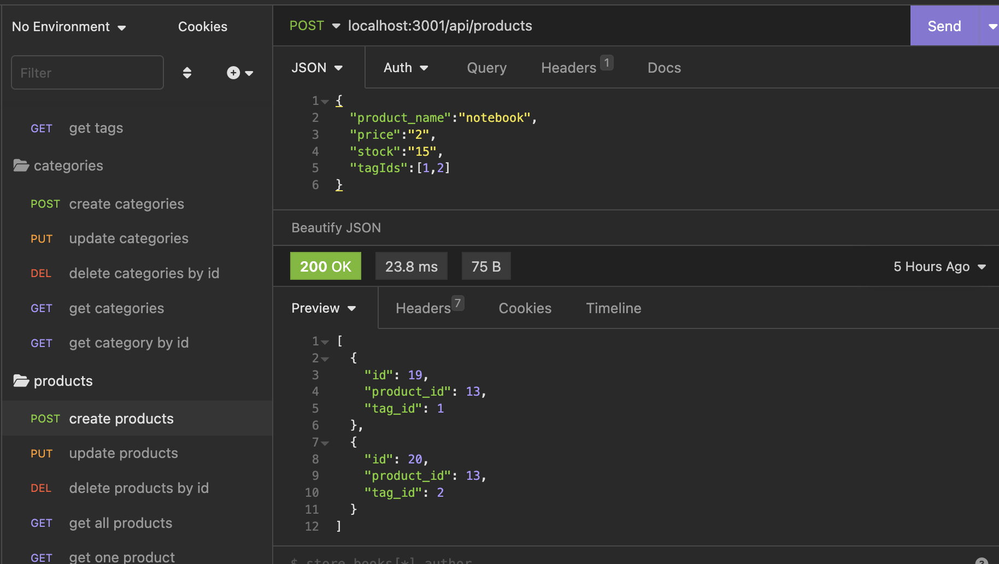
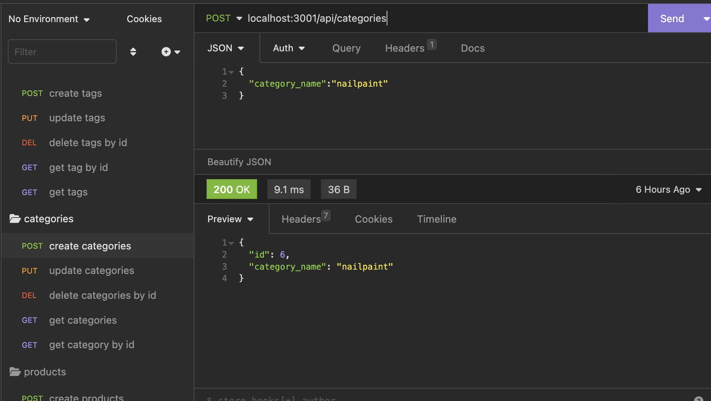
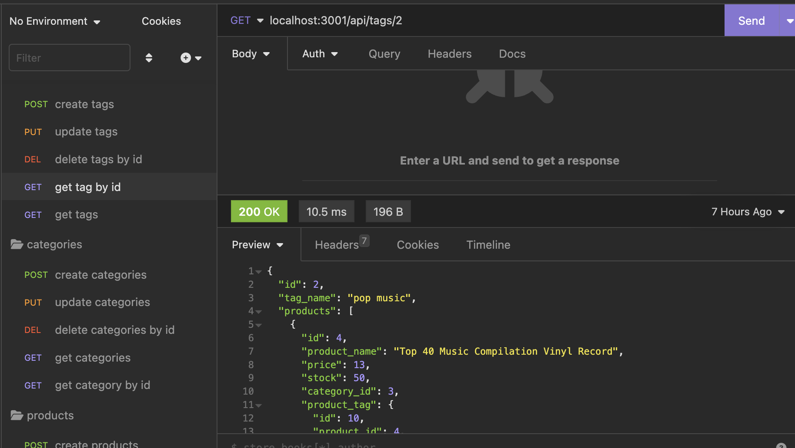

# E-Commerce-Back End-Story

### Contents

1. Discription of Project
2. Screenshot
3. Installation 
4. Walkthrough video link
5. Acknowledgements
6. Questions

## Description of Project
This e-commerce Backend story is an application that is developed by using starter code and uses the command line interface (CLI) and object-relational mapping for various methods of data manipulation, storage, and retrieval when using HTTP methods with a RESTUL API.

## Screenshot
Following is the screenshot of my application:

## Installation 

Git clone this repository using terminal and open the file in VS Code (or in the editor you work with). Install dependencies using "npm install" or "npm i" in terminal and make sure that you are in the reposetory directory, before running "npm install". Now you are ready to seed the data by running the command "npm run seed". You are ready to use the application by the command "npm start".

## Walkthrough video link

https://watch.screencastify.com/v/IkJDid5rhlb9acvQm71r

## Acknowledgements

This project is done for UNB Bootcamp, thanks for the opportunity. I am thankful to my tutor for all the help.

## Questions

If you have any questions, please reach out to me at my github.

https://github.com/calligraphist

---
© 2023 edX Boot Camps LLC. Confidential and Proprietary. All Rights Reserved.
